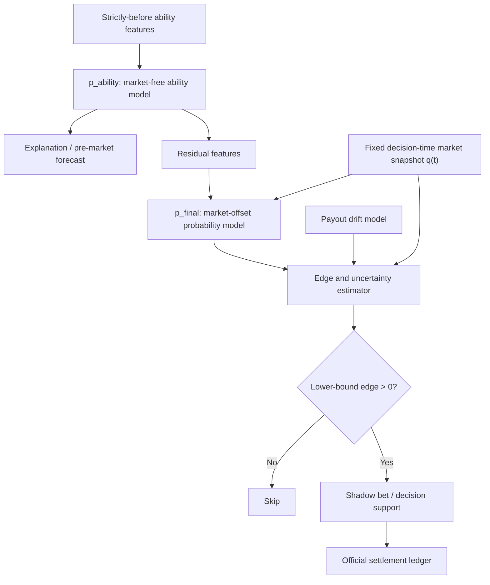

# モデル精度向上・ROI改善の再設計提案

**Status**: PROPOSAL  
**Created**: 2026-07-15  
**Revised**: 2026-07-15 (rev1: 発走前オッズ供給を最優先前提に格上げ / 真のP0を絞り込み / prospective holdoutのtime-to-signalを事前見積もり要件化)  
**Scope**: モデル、特徴量、校正、評価契約、買い目方策、prospective計測基盤  
**Review**: 精度、ROI、批判的監査の3系統で独立レビュー済み

## 1. Executive Summary

現状で最も期待値が高いのは、特徴量を追加し続けることではない。先に次の3点を作り直す。

1. **評価契約**: spec上の完了と実装を一致させ、繰り返し利用した過去OOSを開発集合へ降格する。
2. **モデルの役割**: 市場非依存の能力モデル、判断時市場を使う最終確率モデル、bet/skipを決めるedge policyを分離する。
3. **ROI台帳**: 判断時オッズ、全decision attempt、公式払戻をappend-onlyで保存し、closing proxyを「実現ROI」と呼ばない。

過去の結果から、モデル精度改善とROI改善は別問題である。

- F02はwinner NLLを改善したが、ROI改善は未検証である。
- 現行EV方策は回収倍率`0.721`、odds<21でも`0.818`であり、利益化していない。
- 市場確率は現行モデルより大幅に正確で、市場残差モデルは2014年以降13/13 foldで市場を小幅に上回った。
- したがって、最終精度では市場を利用しつつ、市場非依存の能力シグナルを別モデルとして残す方が合理的である。

本提案の最重要な方針変更は以下である。

> 市場非依存モデルを唯一の正解としない。  
> NLL改善をROI改善とみなさない。  
> 2019–2026を真のconfirmatory holdoutとみなさない。

実行順に関する2つの前提を先に置く。

- **発走前オッズの継続供給がROI系全体の律速**である(§2.9)。台帳を追加してもオッズcaptureが無ければ0行のままなので、これをPhase 0で確認し、目処が立たなければ精度系を先行させる。
- **真のP0は「評価契約の修正(§4.1)+ROI台帳(§4.3)+prospective-faithful化(§4.4)+correctness freeze」に絞る**。serving-compatible baseline(§4.5)と校正A/B/C/D(§4.6)はモデル品質の仕事であり、物差しが直った後の第二波(Phase 2)に置く。

## 2. 現状から確認できた事実

### 2.1 F02は有望だが、最終確定ではない

[F02 verdict](../../artifacts/verdicts/f02_adoption_verdict_2024-2026.json)では、2024–2026の8,773レースについて次の結果だった。

| 指標 | Candidate | Active | 差 |
|---|---:|---:|---:|
| Winner NLL | 2.051328 | 2.057077 | -0.005749 |
| ECE | 0.001502 | 0.001287 | +0.000215 |
| 95% CI | - | - | [-0.010038, -0.001342] |

NLL差は統計ゲートを通過している。一方で、次の理由から本番採用の最終証拠とはしない。

- `all`、`recent_3y`、`recent_5y`が同一の2024–2026母集団であり、recent guardが独立情報を追加していない。
- ECEは相対的に悪化している。
- paired評価recipeと登録モデルでtarget encodingの扱いが一致していない可能性がある。
- 過去の多数のfeature選択で同じ年範囲を参照しており、研究プロセス全体の多重比較が補正されていない。

結論は「有望な探索結果を維持し、評価契約修正後にrecipe-faithfulなconfirmationを1回だけ行う」とする。

### 2.2 F03は現ゲートで非採用

[F03 paired評価](../../out/f03.json)は22,597レースでwinner NLL差`-0.002343`だったが、95% CIは`[-0.005194, +0.000389]`で0を跨いだ。

- Primary improvement: PASS
- Statistical guard: FAIL
- Subgroup guard: PASS
- Final: **REJECT**

点推定が改善していることを理由に閾値やbundle定義を変更して再試行しない。将来、別の独立仮説として再検討する場合は、未使用データと事前登録が必要である。

### 2.3 校正用holdoutが直近データをboosterから除外している

[lgbm-064-f02acc metadata](../../artifacts/model_versions/lgbm-064-f02acc/metadata.json)では次の状態になっている。

- `train_through`: 2026-07-12
- `model_fit_through`: 2020-08-30
- `n_model_rows`: 674,262
- `n_calib_rows`: 278,084

最新30%をisotonic専用に使うため、booster本体が直近約6年を学習していない。市場構造、データソース、競走体系が変化する問題では大きな機会損失になりうる。

### 2.4 068の完了マークと本番経路が一致していない

[068 tasks](../../specs/068-evaluation-contract-calibration/tasks.md)ではT024の日単位splitが完了扱いだが、実装には次の不一致がある。

- [`split_train_by_time`](../../training/src/horseracing_training/calibration.py)はdistinct race数で分割している。
- 日単位の`split_train_by_day`は別関数として存在する。
- [`predictor.py`](../../training/src/horseracing_training/predictor.py)の本番経路は`split_train_by_time`を呼ぶ。
- started-all統合、実DB paired E2E、決定論確認、必須テスト突合の一部が未完了である。

さらに、[`moving_block_bootstrap_ci`](../../eval/src/horseracing_eval/bootstrap.py)は「moving block」と命名されているが、実際は開催日を独立再標本化するblock長1日のcluster bootstrapである。開催を跨ぐ系列相関は保存しない。

### 2.5 同じ過去OOSを逐次選択に使っている

[070 research](../../specs/070-past-market-bundles/research.md)自身が、F03→F04→F05の逐次選択後stackは独立confirmatoryではないと認識している。

各foldが時系列OOSでも、同じ2019–2026を見ながら多数の仕様、特徴、閾値を選んだ時点で、その期間は研究プロセス上の開発集合である。個別bootstrap CIだけではselection biasを補正できない。

### 2.6 現行ROIは利益化を示していない

[064 spec](../../specs/064-odds-cap-betting-policy/spec.md)のproxy結果は次のとおりである。

| Policy | 回収倍率 | 解釈 |
|---|---:|---|
| 現行EV≥1.0 | 0.721 | 大幅な負のedge |
| EV≥1.0 & odds<21 | 0.818 | 損失削減。利益化ではない |
| EV≥1.3 | 0.703 | tail過信を強めて悪化 |
| No-bet | 1.000 | cash benchmark |

production `pl_topk`による最終確認は[064 tasks](../../specs/064-odds-cap-betting-policy/tasks.md)のT028で未完了である。また、評価はclosing odds proxyであり、prospectiveの公式払戻による利益証明ではない。

### 2.7 現行prospectiveはROI計測契約として不十分

主な問題は以下である。

- [`api/backtest.py`](../../api/src/horseracing_api/backtest.py)は判断時に保存した表示オッズを払戻計算にも使用する。
- zero-betレース、取得失敗、post-time違反を含む全opportunityが独立したattemptとして保存されない。
- prospective経路と通常製品経路で、校正器、Kelly、odds capなどの適用が一致しない。
- 校正器がbase model versionを跨いだlatest predictionから動的fitされうる。
- exotic oddsの朝オッズと最終払戻に明確な時点provenanceがない。

パリミュチュエルでは判断時表示オッズは約定価格ではない。判断時オッズは選定監査に使い、精算は公式払戻で行う必要がある。

### 2.8 学習時とserving時のfeature profileが違う

2025–2026ではテン3F、owner、breeder、賞金系などに恒久欠損がある。歴史データで有効でも、本番で常時欠損なら学習時の期待利得は再現しない。

特にownerは履歴テーブルがない状態でlast-write-wins値を使用すると、現在の所属情報を過去レースへ遡及適用する危険がある。時点履歴を整備できない特徴は、本番モデルから撤去する候補とする。

### 2.9 発走前オッズの継続供給が本提案全体の律速条件

本提案のprospective計測(§4.3、§4.4)とholdout(§4.2)は、スキーマ設計ではなくデータ取得が本質的な制約である。

- netkeibaへの継続scrapeは現状ブロックされており、発走前オッズフィードを安定取得できていない。
- 稼働DBは2026-07で更新が停止している。未来レースのingestと発走前オッズの継続captureが動いていない。
- 065 shadow-log自身が「計器は空で始まり、発走前オッズフィード待ちで答えは数か月後」と結論している。

したがって、`market_snapshot`/`decision_attempt`/`settlement`テーブルを追加しても、**発走前オッズを継続取得する運用パイプラインが無ければ台帳は0行のまま**である。この提案では、

- 発走前オッズ取得パイプラインの確立を**Phase 0の必須前提**として扱う(§6)。
- パイプラインが確立できない期間は、台帳は空で始まり答えは将来にしか出ないことを明記する。

を前提とする。オッズ供給の目処が立たない場合、本提案のROI系(§4.3、§4.4、§5.2)は着手しても計測が始まらないため、精度系(§4.1、§4.6以降)を先行させる判断もありうる。

## 3. 目標アーキテクチャ

現在の単一`p`に、能力説明、最終精度、value判定を同時に要求する設計を廃止する。



### 3.1 `p_ability`: 市場非依存の能力モデル

- 対象レースの市場情報を入力しない。
- 説明、早期予測、市場と異なる独立シグナルの供給源とする。
- accuracyだけでなく、市場残差との誤差相関や低履歴馬での情報価値を測る。
- **役割分担を明確にする**: `p_ability`は研究・説明用のartifactであり、プロダクトのbet/skip判断を`p_ability`のaccuracyでゲートしない。プロダクトが返す最終確率は`p_final`とする。過去の実証(相対/相手品質/順位軸はrace-softmax+既存勝率系にほぼ吸収済み)を踏まえ、`p_ability`は二重メンテコストに見合う独立情報価値(市場残差との低相関・低履歴馬でのlift)が測れる場合のみ維持する。

### 3.2 `p_final`: 判断時市場を使う最終確率モデル

第一候補は市場offset残差モデルとする。

```text
p_final_i = softmax(alpha * log(q_i(t)) + f_theta(x_i))
```

- `q(t)`はT-30、T-10、T-2など事前固定した判断時snapshotを使う。
- `f_theta`は能力特徴から市場残差だけを学習する。
- 残差は強く正則化し、q-onlyを超えないfoldでは0方向へ縮約する。
- q-only、p_ability-only、単純blend、market-offset residualを必須baselineにする。
- q-onlyをCI付きで超えない場合、最終確率としてqを採用することを許容する。

[060 tasks](../../specs/060-market-residual-model/tasks.md)では全期間で市場に僅差で敗れた一方、2014年以降は13/13 foldで市場を改善した。rolling、time-decay、現行データprofileで1案だけkill-testする価値がある。

### 3.3 `edge_policy`: bet/skipの意思決定

単純な`p * odds >= threshold`を最終形にしない。

```text
expected_return = E[win * official_payout | decision-time information]
conservative_edge = lower_confidence_bound(expected_return) - 1
```

入力には以下を使う。

- `p_final`とその不確実性
- 判断時オッズとcapture quality
- 判断時オッズから最終払戻へのdrift分布
- field size、odds帯、q帯、モデルと市場の不一致量
- 過去にその情報regimeで残差が再現したか

不確実性込みの下限が0を超える場合だけbet候補とする。単にEV閾値を上げる方法とは異なる。

## 4. 優先順位付き施策

### 4.1 P0: 評価契約を先に修正する

実施項目:

1. 本番経路を日単位splitへ結線する。
2. T014、T019、T035を実データと決定論条件で完了する。
3. `eval_window`、最低開催日数、subgroup guard、main gateを単一の機械判定に統合する。
4. `no_decision_min_days=10`を実際の判定に使用する。
5. bootstrapを正しく命名し、2–4日、開催週、開催単位blockの感度分析を追加する。
6. ECEを全体だけでなく、確率帯、odds帯、p/q帯、bet対象tailで測る。
7. raw modelだけでなく、serving校正、two-gamma、stage discount適用後の最終確率も評価する。

採用条件:

- 同一seed・単一threadで指標差が許容誤差内に再現する。
- recipe hash、race set hash、評価開始・終了日、feature/model/calibrator versionがartifactに残る。
- main gateとcritical subgroupのANDをoperator判断なしで一意に出力する。

### 4.2 P0: 過去期間を開発集合へ降格する

- 2008–2026の既参照期間はdevelopment evidenceと明記する。
- 2026-07-15以降を変更禁止のprospective holdoutとして開始する。
- 仮説、特徴式、閾値、primary metric、停止条件を実験前に登録する。
- 同じholdoutを複数回見る場合はalpha spendingまたはsequentially validな判定を使う。
- 大量候補探索はinner walk-forward内で行い、outer期間では勝者1案だけを判定する。
- **time-to-signalを事前に見積もる**。固定100円・公式払戻で、現行方策(回収0.721)とcap21(0.818)、あるいは1.0を、開催日クラスタCIで分離するのに必要なsettled bet数と暦月数を、単勝配当の分散から先に算出する。高分散のため数か月〜1年超が想定される。この見積もりを登録し、途中でholdoutを覗いて早期判定に流れる誘惑(selection bias再導入)を構造的に防ぐ。見積もりが非現実的なら、ROI holdoutの主目的を「利益検定」から「現行比の損失削減のCI下限>0の確認」に事前に切り下げる。

### 4.3 P0: ROI計測基盤を破壊的に再設計する

「スキーマ変更なし」という過去制約を撤回し、append-onlyで以下を追加する。

#### `market_snapshot`

- race、horse、source
- captured_at、scheduled_post_time、minutes_to_post
- win odds、popularity、全馬coverage、capture quality
- post-time保証、取消状態、source version

#### `decision_attempt`

- 対象となった全レース。betとzero-betの両方を保存
- prediction run、model、feature、calibrator、policy version
- 使用snapshot、実行時刻、bet/skip、skip理由
- weak capture、取得失敗、field不完全も明示的な状態として保存

#### `decision_bet`

- attempt、horse、判断時オッズ、stake
- 選定時p、q、edge、uncertainty、rule version

#### `settlement`

- 公式払戻100円あたり
- refund、void、dead heat、確定時刻
- result/payout sourceとversion

精算には`official_payout_per_100`だけを使用する。判断時オッズから計算した既存指標は`realized ROI`ではなく、`counterfactual_snapshot_return`へ降格・改名する。

### 4.4 P0: prospectiveをproduction-faithfulにする

同じprediction runと同じsnapshotから次のarmを同時生成する。

- current EV
- cap21
- favorite
- no-bet
- candidate policy

追加要件:

- model、feature、calibrator、policyをpinする。
- `odds_asof=None`とpost-time captureをprimaryからfail-closedで除外する。
- 冪等キーを`race + model + calibrator + policy + snapshot`とする。
- production経路とprospective経路の出力を、同じ入力snapshotでbyte比較する。
- cap21はprospective confirmationまでshadow/opt-inを維持する。

### 4.5 P1(第二波): serving-compatible baselineを作る

> これはモデル品質の仕事であり、評価契約(§4.1)が直った後に着手する。物差しが直る前にモデルをいじると、本提案自身が戒めた「不完全な契約のままbpを積む」失敗を繰り返す。

次の3 armを比較する。

1. 現行の全特徴モデル
2. 本番で安定取得できる特徴だけのstable model
3. 過去行にも2025+の欠損patternを適用するsource-masked model

Primaryは2025–2026とprospective holdoutとする。stable modelが勝つ場合は、owner、breeder、prize、first3fなどを本番モデルから撤去する。

予測時点別モデルも比較候補とする。

- pre-entry
- 枠順確定後
- 馬体重取得後
- odds取得後

利用できない特徴をNaNで同じモデルへ通すより、入力契約が明確になる。

### 4.6 P1(第二波): 校正A/B/C/Dを完走する

> §4.5と同じく評価契約(§4.1)確立後の第二波。校正の優劣は直った物差しの上でしか正しく比較できない。

新特徴を追加する前に、次を同一契約で比較する。

| Arm | Booster学習 | 校正 |
|---|---|---|
| A | 70% | latest 30% isotonic、現行再現 |
| B | 90% | latest 10% isotonic |
| C | 全履歴refit | strict-past OOF temperature |
| D | 全履歴refit | strict-past OOF race-normalized power |

勝者だけをprospective confirmationへ進める。校正器は`base_model_version + recipe_hash + feature_version`単位のimmutable artifactにし、異なるモデル世代を混ぜて動的fitしない。

### 4.7 P1: target encodingをstrict-pastへ変更する

現行OOF TEはouter-validへの直接target leakは防ぐ。問題はleakではなく**表現の不一致**である。OOFエンコードは学習時にfold全体の統計を使うため各過去行のエンコード値がその行より後のレースの情報を含みうる一方、serving時は判断時点までの情報しか使えない(prequential)。この学習時OOF ⇔ serving prequentialの表現差が、期待利得の再現性を損なう。

> 注: 投資前に、この表現差が実際に有意な劣化を生むかをfocusedに確認する(OOFは本来leak対策であり、勝負どころは「learning-serving表現一致」の効果量)。

候補:

- 日単位prequential ordered TE
- 90日、365日recent posterior
- count、posterior variance、unknown率
- jockey/trainer交互作用は十分な件数を満たす場合だけ縮約付きで使用
- CatBoost ordered encodingを比較armにする

### 4.8 P1: `pl_topk`専用HPOとearly stopping

現行の固定300 round、31 leaves、learning rate 0.05を疑う。outer-validで選ばず、inner walk-forwardだけで次を選択する。

- `num_leaves`: 15 / 31 / 63
- `min_child_samples`: 50 / 200 / 500
- `reg_lambda`: 1 / 5 / 20
- feature fraction: 0.7 / 0.9 / 1.0
- learning rate: 0.02 / 0.05
- maximum rounds: 1,200、winner NLL early stopping
- PL stage weightsとtop-kは少数の事前固定候補のみ

HPOによる改善幅は小～中と想定するが、新規データ取得なしで実行できる。

### 4.9 P1: 時間適応を比較する

市場残差モデルと能力モデルの双方で次を比較する。

- expanding window
- 直近N年rolling window
- exponential time decay
- source/regime別mixture of experts

source、開催形態、データcoverageが変化しているため、全期間同一重みを当然視しない。選択はnested walk-forward内で行う。

### 4.10 P1: 次に試す特徴量

優先順位は次のとおりとする。

1. **F07 hierarchical speed / track variant**  
   過去に絶対時計が大きく効いた。track variant補正、馬の潜在能力mean、trend、posterior variance、経過日数によるprocess noiseを追加する。
2. **F06 rotation / form state**  
   休養、叩き回数、近走変化を時点付き状態として表す。
3. **F09 human recent pair**  
   jockey/trainer/horseのrecent interactionを縮約付きで扱う。
4. **F10 hierarchical aptitude**  
   surface、distance、venue適性を階層縮約する。

血統embeddingは優先しない。再挑戦条件は、3代以上の時点付きpedigree graph、outer-train内embedding学習、既存sire/BMS集計に対する純増分検証が揃うこととする。

### 4.11 P1: 払戻driftと不確実性付きedge

判断時オッズから最終払戻への変化を明示的にモデル化する。

- 固定capture時刻別の最終払戻分布
- favorite/longshot、field size、開催、流動性別のdrift
- prediction ensemble/fold分散
- odds帯別・q帯別の校正誤差
- payout downside scenario

bet条件は点推定EVではなく、expected returnの下側信頼限界とする。正edgeがprospectiveに確認されるまでは固定100円で比較し、Kellyは無効にする。

### 4.12 P2: 高コスト研究

#### Race-set model

- 小規模DeepSetsまたはSet Transformer
- 各馬encoder + race pooled context + PL top-k loss
- race内順序のpermutation equivarianceをテスト
- LightGBMと誤差相関が十分低い場合だけstack候補にする

#### Pace mixture-of-PL

- slow / normal / fastの潜在pace scenario
- 脚質、位置取り適性からscenario別scoreを生成
- scenarioを周辺化してjoint確率を出力
- winner NLLだけでなくexacta/trifecta joint NLLで評価

exoticの時点付き実オッズと公式払戻が蓄積するまで、ROI採用には使用しない。

## 5. 採用ゲート

### 5.1 Accuracy Gate

Primary:

- race-level winner NLLのpaired差
- 開催単位を考慮した95% CI上限 `< 0`

Guards:

- top2/top3 LogLossの非劣性
- overallおよびtail conditional ECE
- 近年、canonical、netkeiba、低履歴などcritical subgroupの非劣性
- q-only、市場なしactive、uniformとの比較
- serving最終確率まで含めた再評価

### 5.2 ROI Gate

Primary:

- 同一race、同一snapshot、固定100円のpaired net-profit差
- 公式払戻を使用
- 開催日または開催単位cluster CI

Guards:

- zero-betを含む全opportunity
- minimum bet countとcoverage
- 月別・年別安定性
- worst period
- max drawdown、最大連敗、log growth
- leave-one-winner-out
- weak/post-time capture除外
- no-bet、favorite、current EV、cap21との比較
- **事前登録したtime-to-signal見積もり(§4.2)に対する到達状況**。必要sample未達での早期判定を禁止する

昇格段階:

1. Offline改善: research artifactのみ
2. Prospectiveで現行比損失削減のCI下限が正: decision-support候補
3. 公式払戻ROIのCI下限が1を超える: 利益候補
4. 正のlog growthとrisk guardを満たす: stake optimization候補

### 5.3 Kelly再開条件

次をすべて満たすまで、primary比較は固定100円とする。

- prospective公式払戻で正edge
- ROIまたはnet-profit差の信頼区間が事前登録基準を通過
- odds/payout driftが校正済み
- bankroll不足、100円丸め、race/day総risk limitを実装
- 券種横断portfolio riskとmarket impactを考慮

Kellyはedgeを生み出さず、存在するedgeの配分を最適化するだけである。

## 6. 実行順

### Phase 0: Correctness freeze + データ供給の目処確認

1. **発走前オッズ取得パイプラインの目処を確認する**(§2.9)。継続captureが立たない場合は、ROI系(Phase 1)を保留し精度系(Phase 2)を先行する分岐をここで決める。
2. 070のF03–F05を探索扱いにし、本番昇格を止める。
3. F03を現ゲートでREJECTとして固定する。
4. 068のsplit、gate、bootstrap、未完了E2Eを修正する(真のP0=§4.1)。
5. 既存shadow指標から`realized`表現を外す。

### Phase 1: Measurement foundation（発走前オッズ供給が前提）

6. 発走前オッズの継続captureパイプライン(未来レースのingestを含む)を確立する。**これがPhase 1全体の律速**。
7. `market_snapshot`、`decision_attempt`、`decision_bet`、`settlement`を追加する。
8. prospectiveとproductionのpolicy parityをテストする。
9. current、cap21、favorite、no-betを同じsnapshotで収集開始する。
10. prospective holdoutのtime-to-signal(必要sample数・暦月数)を算出し登録する(§4.2)。
11. 2026-07-15以降をprospective holdoutとして固定する。

### Phase 2: Low-cost model corrections（評価契約=§4.1確立後の第二波）

12. stable/source-masked modelを比較する(§4.5)。
13. 校正A/B/C/Dを完走する(§4.6)。
14. strict-past ordered TEを評価する。
15. PL専用HPOとearly stoppingを評価する。

### Phase 3: Architecture challengers

16. 固定判断時点のq-only baselineを確立する。
17. rolling/time-decay market-offset residualを1案だけkill-testする。
18. hierarchical speed v2、rotation/formを順番に評価する。
19. payout driftとuncertainty lower-bound policyをshadow評価する。

### Phase 4: Prospective decision

20. 事前登録した終了日またはsequential ruleでprospective判定する。
21. accuracy採用とROI採用を別artifactとして保存する。
22. 正edgeが確認できない場合、no-betを既定のまま維持する。
23. 正edge確認後にだけKelly、自動購入、exotic拡張を検討する。

## 7. 明示的に再試行しない案

- EV閾値を上げるだけの方策
- `p-q`が大きい馬をそのまま買う方策
- 51倍超tailを含む全馬EV買い
- Elo/Bradley–Terryの小変更
- closing-3F単独追加
- 既存特徴の単純な積、rank、gapの量産
- 直接top2/top3 binaryモデル
- 現在の名前列だけを使う血統embedding
- 同じ2019–2026を見ながらbundle定義や閾値を修正すること
- 実オッズの時点provenanceなしでexotic ROIを採用根拠にすること

## 8. 意思決定上の注意

- 精度改善は価値があるが、ROI改善を保証しない。市場模倣が強まるほどNLLが改善しても、`p-q`の見かけのedgeは縮む可能性がある。
- ROI計測基盤は直接ROIを上げないが、偽改善を排除するため最優先である。
- 市場残差モデルの近年改善幅は小さく、価格変動や校正誤差で消える可能性がある。期待利益ではなく、再現可能な残差の符号を検定する。
- race-set modelやpace mixtureは新しい帰納バイアスを持つが、評価基盤とデータ時点が直る前に試すと研究自由度を増やすだけになる。
- cap21は現状では「利益方策」ではなく「出血削減方策」である。prospective confirmationまではshadow/opt-inを維持する。

## 9. 最終提案

次の開発featureは新しい特徴量bundleではなく、以下を一つの基盤featureとして扱うことを推奨する。

**Evaluation and Prospective ROI Contract**

- specと実装のsplit/gate不一致修正
- immutable recipeとcalibrator artifact
- append-only snapshot/attempt/settlement台帳
- production-faithful multi-arm shadow
- prospective holdoutとsequential decision rule

この基盤が完成した後、stable model、校正A/B/C/D、strict-past TE、market-offset residual、speed v2の順で検証する。現時点で最も避けるべきなのは、不完全な評価契約のままNLL数bpの改善を積み上げ、それをROI改善へ読み替えることである。
